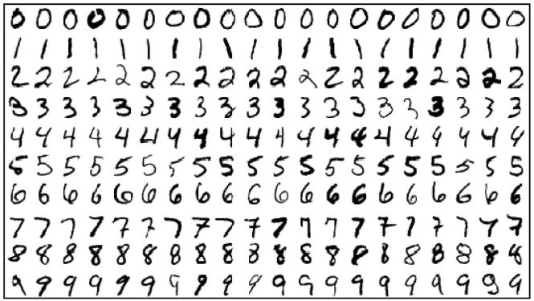
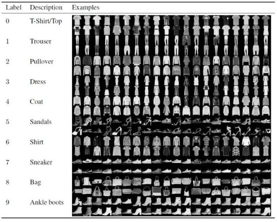

## 手写数字K近邻分类

## 作业内容：

实现K近邻方法，并在MNIST或FashionMNIST数据集上实现图像分类。

- 可以只使用数据集中10%的数据；
- 采取不同的k对性能的影响？
- 图像特征要不要探索一下？
- 运算效率如何？
- Top-n 精度如何？
- 混淆矩阵？
- 跟scikit-learn官方代码对比呢？

**MNIST图像示例：**



**FashionMNIST图像示例：**



## 技术报告要求

- 提交PDF格式技术报告
- 内容完备：方法简介、实验设置、实验结果及分析、代码；参考下面的`技术报告内容示例`
- 格式规范、排版美观
- 推荐：Jupyter Notebook，按照LaTex 打印格式输出PDF，或输出html

## 作业提交说明：

- 技术报告：PDF格式或html，命名为：**《深度学习》作业1-姓名**
- 代码：作为技术报告附录，或python源文件（命名为：**《深度学习》作业1-姓名**）。
- 提交至作业邮箱，邮件标题：**《深度学习》作业1-姓名**
- 截止时间：2021年4月8日12:00。


## 技术报告内容示例：

### 1.K近邻分类算法简介

>  算法简介

伪代码：

```
算法X.  算法名称.
输入：… …
输出：… …
```

\*算法描述，字体为五号宋体

### 2.实验设置及结果分析

首先介绍实验的数据库，然后介绍实现算法时用到的编程语言、工具包等，之后介绍实验的设置，之后汇报实验结果，并对结果进行分析。

#### 2.1 数据集

数据集简介及数据集划分

#### 2.2 性能指标

采用的性能指标，各自的计算公式和物理含义

#### 2.3 采取不同的k对性能的影响

展示结果，并分析不同的k对性能的影响

#### 2.4 采取不同的图像特征对性能的影响（可选）

展示结果，并分析

#### 2.5 混淆矩阵

展示结果，并分析

#### 2.6 Top-n精度如何

展示结果，并分析

#### 2.7 跟scikit-learn官方代码对比（可选）

展示结果，并分析

### 3. 总结与展望

总结自己的工作，指出存在的问题，及未来可能的改进方法

### 参 考 文 献

[1] 网上的文献（举例：The Cooperative Association for Internet Data Analysis(CAIDA) [EB/OL],http://www.caida.org/data 2010,7,18）采用脚注，一般不作为参考文献。
[2] Zhou Yong-Bin, Feng Deng-Guo. Design and analysis of cryptographic protocols for RFID. Chinese Journal of Computers, 2006, 29(4): 581-589 (in Chinese)
(周永彬, 冯登国. RFID安全协议的设计与分析. 计算机学报, 2006, 29(4): 581-589)

### 附录：代码（或提供python代码源文件）


\> 返回[深度学习课程](https://aiart.live/courses/dl.html)